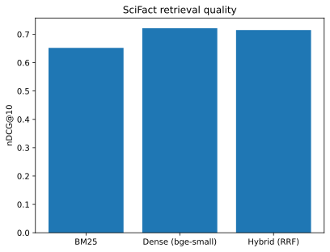

# Retrieval evaluation: BM25 vs dense vs hybrid on SciFact

The retrieval layer of a RAG system, measured properly. Three retrievers are compared on a labelled benchmark with standard ranking metrics and bootstrap confidence intervals, plus a small search API.

**Data:** [BEIR SciFact](https://github.com/beir-cellar/beir): 5,183 scientific abstracts and 300 test claims, each with human relevance labels.

| Retriever | nDCG@10 | 95% CI | Recall@10 | MRR@10 |
|---|---|---|---|---|
| BM25 (`rank_bm25`) | 0.652 | 0.606-0.697 | 0.776 | 0.618 |
| Dense (`BAAI/bge-small-en-v1.5`, cosine) | **0.722** | 0.677-0.761 | **0.840** | **0.689** |
| Hybrid (BM25 + dense, reciprocal rank fusion, k=60) | 0.715 | 0.671-0.757 | 0.827 | 0.685 |

All numbers come from `python -m src.evaluate` (see `reports/eval.json`). Bootstrap CI: 1,000 resamples over queries.



## What the results say
- Dense retrieval beats BM25 by about 7 nDCG points. The confidence intervals overlap a little, so the gap is real in direction but not tightly pinned down with 300 queries.
- Plain reciprocal rank fusion did **not** beat dense alone here (0.715 vs 0.722, well inside the noise). Hybrid search is not automatically better; weighting or a reranker would be the next thing to try.
- These are retrieval metrics only. No answer generation was run, so no faithfulness numbers are claimed.

## Run it
```bash
pip install -r requirements.txt
python -m src.evaluate        # downloads SciFact, embeds the corpus (slow on CPU), writes reports/
python -m pytest tests -q     # metric unit tests
uvicorn src.app:app --port 8000
curl "localhost:8000/search?q=vitamin+D+prevents+fractures&method=hybrid"
```

## Layout
- `src/data.py` dataset download and loading
- `src/retrievers.py` BM25, dense and RRF hybrid retrievers
- `src/metrics.py` nDCG, recall and MRR (unit tested)
- `src/evaluate.py` evaluation and plot
- `src/app.py` FastAPI search endpoint

## Limitations
One dataset, one small embedding model, no reranker, no generation step. Embedding the corpus on a 1-core CPU took about 15 minutes; the embeddings are cached in `data/` (git-ignored).
